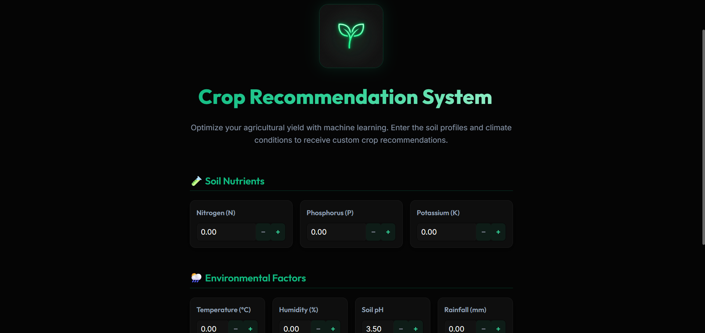
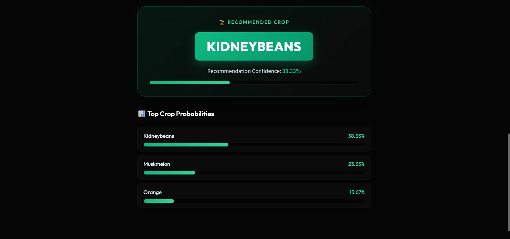

<div align="center">
  
</div>  
  
# 🌾 Crop Recommendation System

<div align="center">
  [](https://www.python.org/)
  [](https://streamlit.io/)
  [](https://scikit-learn.org/)
  [](#-model-performance)

**An intelligent Machine Learning-based system designed to assist farmers and agricultural enthusiasts in choosing the most suitable crop for their land. By analyzing soil composition and environmental conditions, the system provides high-accuracy recommendations to maximize yield and sustainability.**

</div>

---

## 🚀 Key Features

- **Precision Recommendations**: Predicts the best crop based on 7 critical soil and environmental parameters.
- **Top-3 Crop Alternatives**: Provides the primary recommendation along with the next two most likely alternatives.
- **Real-time Confidence Score**: Displays a probability percentage for each suggested crop.
- **Premium Dark UI**: A modern, interactive, and responsive web interface designed with custom CSS on Streamlit.
- **Fast & Efficient**: Lightweight joblib serialization ensures instant predictions.

---

## 🧠 Soil & Environmental Parameters

The system considers the following agricultural parameters to make predictions:

| Parameter          | Metric / Range | Description                            |
| :----------------- | :------------- | :------------------------------------- |
| **Nitrogen (N)**   | 0 - 300        | Ratio of Nitrogen content in soil      |
| **Phosphorus (P)** | 0 - 150        | Ratio of Phosphorus content in soil    |
| **Potassium (K)**  | 0 - 200        | Ratio of Potassium content in soil     |
| **Temperature**    | 0 - 50 °C      | Ambient temperature in degrees Celsius |
| **Humidity**       | 0 - 100%       | Relative atmospheric humidity          |
| **pH Value**       | 3.5 - 9.0      | Soil pH scale (acidity or alkalinity)  |
| **Rainfall**       | 0 - 2000 mm    | Average annual or seasonal rainfall    |

---

## 📊 Model Performance

- **Machine Learning Algorithm**: Random Forest Classifier
- **Feature Preprocessing**: `StandardScaler` for feature scaling
- **Dataset**: High-quality historical agricultural records containing multiple crop classes (rice, maize, chickpea, kidneybeans, pigeonpeas, mothbeans, mungbean, blackgram, lentil, pomegranate, banana, mango, grapes, watermelon, muskmelon, apple, orange, papaya, coconut, cotton, jute, coffee).
- **Model Accuracy**: **`99.09%`** achieved on the validation dataset.

---

## 💻 Tech Stack

- **Backend & Frontend**: Python & Streamlit (with custom CSS injection)
- **Machine Learning**: Scikit-Learn
- **Data Analysis & Handling**: Pandas & NumPy
- **Model Serialization**: Joblib (loads `crop_recommendation_model.pkl`, `scaler.pkl`, `label_encoder.pkl`)

---

## ⚙️ Installation & Setup

Follow these steps to run the application locally on your machine:

### Prerequisites

Make sure you have **Python 3.8 or higher** installed.

### 1. Clone the Repository

```bash
git clone https://github.com/Aniruddhasain7/AI-Crop-Recommendation-System.git
cd AI-Crop-Recommendation-System
```

### 2. Create a Virtual Environment (Recommended)

```bash
# On Windows
python -m venv venv
venv\Scripts\activate

# On macOS/Linux
python3 -m venv venv
source venv/bin/activate
```

### 3. Install Dependencies

```bash
pip install -r requirements.txt
```

### 4. Run the Streamlit Web Application

```bash
streamlit run app.py
```

This will start a local server and automatically open the application in your default web browser (usually at `http://localhost:8501`).

---

## 📁 Project Structure

```text
├── .streamlit/                 # Streamlit configuration files
├── assets/                     # Application logo and UI screenshots
│   ├── crop_logo.png
│   ├── ss1.png
│   └── ss2.png
├── app.py                      # Main Streamlit web application
├── Crop_Recommendation.ipynb    # Model training & analysis notebook
├── Crop_recommendation.csv      # Raw training dataset
├── crop_recommendation_model.pkl# Serialized Random Forest Classifier
├── label_encoder.pkl            # Serialized label encoder for classes
├── scaler.pkl                  # Serialized feature scaler
├── requirements.txt            # Python dependencies
└── README.md                   # Project documentation
```

---

## 📸 Application Preview

### 1. User Interface & Recommendation Output

The modern dark-themed interface showing the input form and recommendation card with confidence score.



### 2. Top-3 Crop Probabilities

Detailed analytics showing alternative crop recommendations and their respective probabilities.



---

## 🔮 Future Enhancements

- 📡 **IoT & Sensors**: Real-time soil monitoring by fetching inputs directly from physical sensor nodes.
- ☁️ **Weather API Integration**: Fetch ambient temperature, humidity, and rainfall dynamically using GPS/location coordinates.
- 🌐 **Multi-Language Support**: Localization in regional languages to support local farmers.
- 🧪 **Fertilizer Recommendation**: Provide smart nutrient/fertilizer suggestions based on the predicted crop and soil deficits.
